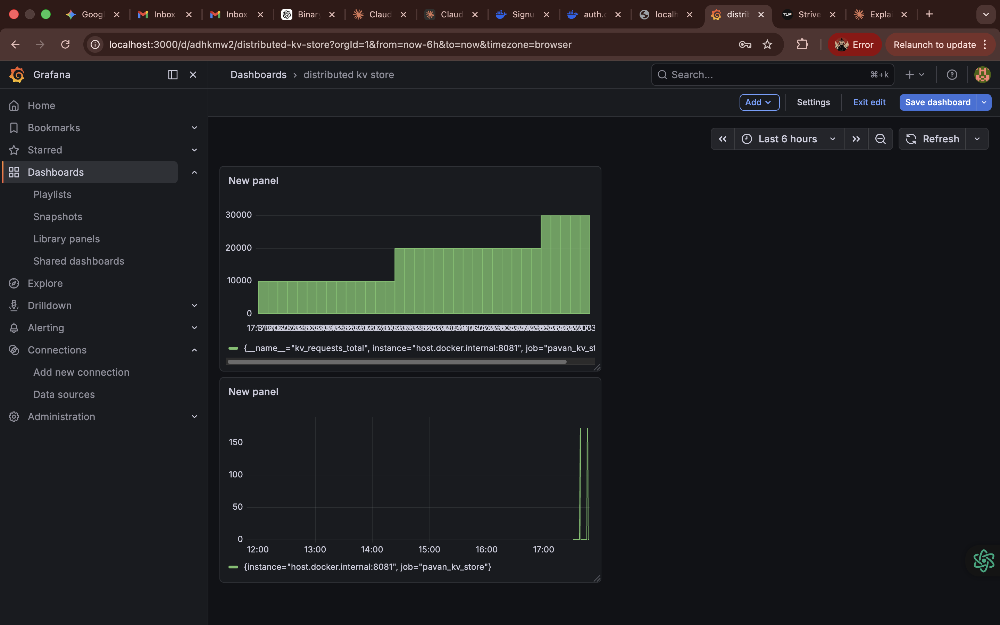

# 🚀 VelocityDB: High-Performance Distributed Key-Value Store

VelocityDB is a multithreaded, in-memory NoSQL database engine written entirely from scratch in C++. Built on raw POSIX sockets, it features a Raft-inspired Leader-Follower architecture for high availability, Write-Ahead Logging (WAL) for crash recovery, and a native Prometheus HTTP metrics endpoint for real-time observability.

This project was built to explore low-level system design, distributed networking, and high-concurrency memory management.

## 🔥 Engineering Highlights

* **Blazing Fast:** Achieves **17,500+ Requests Per Second (RPS)** natively and **~9,000 RPS** inside a Docker container with **~0.1ms latency**.
* **Distributed & Fault-Tolerant:** Implements a Leader-Follower cluster with active heartbeats. If the Leader goes down, the Follower automatically detects the timeout and promotes itself to Leader within 2 seconds.
* **ACID Durability (WAL):** In-memory data is backed by a persistent Write-Ahead Log. If the server crashes or loses power, the engine reconstructs the exact state of the database upon reboot.
* **Thread-Safe Concurrency:** Utilizes `std::mutex` locking to safely handle thousands of simultaneous client socket connections without memory corruption.
* **Real-Time Observability:** Features a custom-built HTTP parser running directly on the TCP socket to expose lock-free `std::atomic` counters to Prometheus and Grafana, tracking metrics without slowing down database throughput.
* **Full-Stack Integration:** Includes a Python (Flask) middleman API acting as a secure Auth Portal, demonstrating how web frontends interact with the raw TCP database via SHA-256 hashed credentials.

## 📊 Performance Benchmarks

*(Note: Ensure you upload your Grafana spike screenshot to your repository and replace `screenshot.jpg` with your actual file name!)*



* **Test Environment:** 10,000 concurrent `SET` operations via Python socket benchmark.
* **Native Execution:** 17,500+ RPS
* **Dockerized Execution:** ~8,982 RPS (The "Docker Tax" via virtualized network bridge and disk I/O).

## ⚙️ System Architecture


1. **The Engine:** A C++ TCP server listening on port `8081`. Uses `std::unordered_map` for O(1) key-value lookups in RAM.
2. **The Middleman:** A Python Flask backend that accepts HTTP requests from the browser, hashes passwords, and opens temporary TCP sockets to speak to the C++ database.
3. **The Monitoring Stack:** Prometheus scrapes the custom `/metrics` endpoint every 2 seconds, and Grafana visualizes the `kv_requests_total` load.

## 🚀 Quick Start Guide

### 1. Run the Database (Docker)
Ensure Docker is installed, then pull and run the pre-configured cluster node:
```bash
docker run -p 8081:8081 pavan-kv-store
